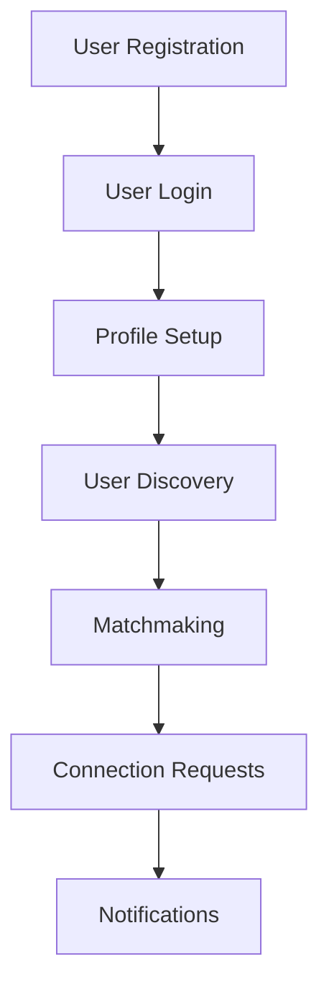

# Mentorship Website Documentation

## Overview
This document outlines the functionality, database schema, and design pattern for the mentorship website. The platform connects mentors and mentees, facilitating skill-sharing and professional growth.

---

## Database Schema
### 1. **users Table**
Purpose: Store basic user authentication details.

| Column       | Data Type      | Constraints                                 |
|--------------|----------------|---------------------------------------------|
| id           | INT            | PRIMARY KEY, AUTO_INCREMENT                |
| email        | VARCHAR(255)   | UNIQUE, NOT NULL                           |
| password     | VARCHAR(255)   | NOT NULL                                   |
| role         | ENUM('mentor', 'mentee') | NOT NULL                          |
| profile      | INT            | FOREIGN KEY (profiles.id)                  |
| created_at   | TIMESTAMP      | DEFAULT CURRENT_TIMESTAMP                  |
| updated_at   | TIMESTAMP      | DEFAULT CURRENT_TIMESTAMP ON UPDATE CURRENT_TIMESTAMP |

### 2. **profiles Table**
Purpose: Store user-specific profile details like skills, interests, and bio.

| Column       | Data Type      | Constraints                                 |
|--------------|----------------|---------------------------------------------|
| id           | INT            | PRIMARY KEY, AUTO_INCREMENT                |
| bio          | TEXT           | NULLABLE                                   |
| skills       | JSON           | NULLABLE                                   |
| interests    | JSON           | NULLABLE                                   |
| created_at   | TIMESTAMP      | DEFAULT CURRENT_TIMESTAMP                  |
| updated_at   | TIMESTAMP      | DEFAULT CURRENT_TIMESTAMP ON UPDATE CURRENT_TIMESTAMP |

### 3. **mentorship_requests Table**
Purpose: Track mentorship connection requests between users.

| Column       | Data Type      | Constraints                                 |
|--------------|----------------|---------------------------------------------|
| id           | INT            | PRIMARY KEY, AUTO_INCREMENT                |
| sender_id    | INT            | FOREIGN KEY (users.id)                     |
| receiver_id  | INT            | FOREIGN KEY (users.id)                     |
| status       | ENUM('pending', 'accepted', 'declined') | DEFAULT 'pending' |
| created_at   | TIMESTAMP      | DEFAULT CURRENT_TIMESTAMP                  |
| updated_at   | TIMESTAMP      | DEFAULT CURRENT_TIMESTAMP ON UPDATE CURRENT_TIMESTAMP |

### 4. **notifications Table**
Purpose: Store notifications for mentorship requests and updates.

| Column       | Data Type      | Constraints                                 |
|--------------|----------------|---------------------------------------------|
| id           | INT            | PRIMARY KEY, AUTO_INCREMENT                |
| sender_id    | INT            | FOREIGN KEY (users.id)                     |
| receiver_id  | INT            | FOREIGN KEY (users.id)                     |
| content      | VARCHAR(500)   | NOT NULL                                   |
| is_read      | BOOLEAN        | DEFAULT FALSE                              |
| created_at   | TIMESTAMP      | DEFAULT CURRENT_TIMESTAMP                  |

---

## Flowchart
The following flowchart illustrates the main functionalities of the mentorship website:



- **User Registration:** New users sign up for the platform by providing basic details.
- **User Login:** Registered users log in to access their profiles and other features.
- **Profile Setup:** Users create and edit their profiles, specifying skills, interests, and bio.
- **User Discovery:** Users browse other profiles based on filters like role, skills, and interests.
- **Matchmaking:** The platform suggests mentorship matches based on user preferences and profile information.
- **Connection Requests:** Users send, receive, accept, and decline mentorship requests.
- **Notifications:** Users receive notifications for new mentorship requests or updates.

---

## Floder Structure
```bash
mentorship-website/
├── backend/
│   ├── config/
│   │   ├── default.json
│   │   └── production.json
│   ├── public/
│   ├── src/
│   │   ├── db_services/
│   │   │   ├── v1/
│   │   ├── hooks/
│   │   ├── middleware/
│   │   ├── service_endpoints/
│   │   ├── services/
│   │   │   ├── v1/
│   │   ├── utils/
│   ├── app.hooks.ts
│   ├── app.ts
│   ├── authentication.ts
│   ├── channels.ts
│   ├── declarations.d.ts
│   ├── index.ts
│   ├── logger.ts
│   ├── objection.ts
│   ├── test/
│   ├── package.json
│   └── tsconfig.json
├── frontend/
│   ├── public/
│   ├── src/
│   │   ├── api/
│   │   ├── app/
│   │   ├── components/
│   │   ├── redux/
│   └── next.config.js
│   └── postcss.config.mjs
│   └── tailwind.config.js
│   ├── package.json
│   └── tsconfig.json
├── .gitignore
└── README.md
```

- **backend:** Contains the backend code for the mentorship website.
  - **config:** Configuration files for different environments.
  - **public:** Public assets like images, stylesheets, and scripts.
  - **src:** Source code for the backend application.
    - **db_services:** Database services and models.
    - **hooks:** Custom hooks for the application.
    - **middleware:** Middleware functions for the application.
    - **service_endpoints:** API endpoints for the application.
    - **services:** Business logic services for the application.
    - **utils:** Utility functions for the application.
  - **app.hooks.ts:** Application hooks for handling events.
  - **app.ts:** Main application file for setting up the server.
  - **authentication.ts:** Authentication logic for the application.
  - **channels.ts:** Real-time communication channels for the application.
  - **declarations.d.ts:** Type declarations for the application.
  - **index.ts:** Entry point for the application.
  - **logger.ts:** Logging configuration for the application.
  - **objection.ts:** Objection.js configuration for the application.
  - **test:** Test files for the application.
  - **package.json:** Node.js package configuration file.
  - **tsconfig.json:** TypeScript configuration file.

- **frontend:** Contains the frontend code for the mentorship website.
  - **public:** Public assets like images, stylesheets, and scripts.
  - **src:** Source code for the frontend application.
    - **api:** API functions for communicating with the backend.
    - **app:** Main application components and pages.
    - **components:** Reusable components for the application.
    - **redux:** Redux store configuration and actions.
  - **next.config.js:** Next.js configuration file.
  - **postcss.config.mjs:** PostCSS configuration file.
  - **tailwind.config.js:** Tailwind CSS configuration file.
  - **package.json:** Node.js package configuration file.
  - **tsconfig.json:** TypeScript configuration file.

- **.gitignore:** Git ignore file for the project.
- **README.md:** Project documentation file.

---

## Functionalities
### 1. **User Authentication**
- Users can register and log in to the platform.
- Passwords are securely hashed and stored in the database.
- User sessions are managed using JWT tokens.

### 2. **Profile Management**
- Users can create, edit, and delete their profiles.
- Profiles include details like bio, skills, and interests.
- Users can upload profile pictures.

### 3. **User Discovery**
- Users can search and filter other profiles based on role, skills, and interests.
- Profiles are displayed in a visually appealing and user-friendly manner.
- Users can view detailed profiles and connect with others.

### 4. **Matchmaking Algorithm**
- The platform suggests mentorship matches based on user preferences and profile information.
- The algorithm takes into account factors like skills, interests, and availability.

### 5. **Connection Requests**
- Users can send, receive, accept, and decline mentorship requests.
- Connection requests are tracked in the database with appropriate status updates.
- Users can view their pending, accepted, and declined connections.

### 6. **Notifications**
- Users receive real-time notifications for new mentorship requests and updates.
- Notifications are displayed in a user-friendly and accessible format.
- Users can mark notifications as read or unread.

---

## Design Patterns
### 1. **MVC Architecture**
- The application follows the Model-View-Controller design pattern.
- Models represent the data structures and business logic.
- Views are responsible for rendering the user interface.
- Controllers handle user input and application flow.

### 2. **Service Layer**
- Business logic is encapsulated in service classes.
- Services interact with models and other services to perform operations.
- Services are reusable and testable components of the application.

### 3. **Repository Pattern**
- Database operations are abstracted using repository classes.
- Repositories provide a clean interface for interacting with the database.
- Repositories are used by services to access and manipulate data.

---

## Technologies Used
### 1. **Backend**
- **Feathers.js:** Web framework for building real-time applications.
- **Node.js:** JavaScript runtime for building server-side applications.
- **Express.js:** Web application framework for Node.js.
- **Objection.js:** SQL-friendly ORM for Node.js.
- **Knex.js:** SQL query builder for Node.js.
- **JWT:** JSON Web Tokens for user authentication.
- **Jest:** Testing framework for Node.js applications.
- **Supertest:** HTTP assertion library for Node.js applications.

### 2. **Frontend**
- **Next.js:** React framework for building server-side rendered applications.
- **React:** JavaScript library for building user interfaces.
- **Redux:** State management library for React applications.
- **Tailwind CSS:** Utility-first CSS framework for building responsive designs.
- **Feather Client:** Real-time communication library for Feathers.js applications.
- **Axios:** Promise-based HTTP client for the browser and Node.js.
- **Jest:** Testing framework for React applications.
- **React Testing Library:** Testing utilities for React components.

### 3. **Database**
- **MySQL:** Relational database management system.
- **Objection.js:** ORM for interacting with MySQL databases.
- **Knex.js:** Query builder for building SQL queries.

---

## Deployment
### 1. **Backend Deployment**
- **render.com:** Platform for deploying and scaling web applications.
- **AWS:** S3 for storing static assets.

### 2. **Frontend Deployment**
- **Vercel:** Platform for deploying Next.js applications.
---

## Security
### 1. **Authentication**
- **JWT Tokens:** Secure tokens are used for user authentication.
- **Password Hashing:** User passwords are securely hashed before storage.
- **Session Management:** User sessions are managed securely using JWT tokens.

### 2. **Data Protection**
- **Data Encryption:** Sensitive data is encrypted during transmission.
- **Data Masking:** Personal data is masked to protect user privacy.
- **Data Access Control:** Role-based access control is implemented to restrict data access.

### 3. **Secure Communication**
- **HTTPS:** Secure communication is enforced using HTTPS.
- **CORS:** Cross-Origin Resource Sharing is configured to prevent unauthorized access.

### 4. **Input Validation**
- **Input Sanitization:** User input is sanitized to prevent SQL injection and XSS attacks.
- **Validation Rules:** Input fields are validated to ensure data integrity and security.

---

## Testing
### 1. **Unit Testing**
- **Jest:** Testing framework for Node.js applications.
- **Supertest:** HTTP assertion library for Node.js applications.
- **React Testing Library:** Testing utilities for React components.

### 2. **Integration Testing**
- **API Testing:** Endpoints are tested for correct responses and error handling.
- **Database Testing:** Database operations are tested for correctness and consistency.

### 3. **Coverage Reports**
- **Code Coverage:** Test coverage reports are generated to ensure comprehensive testing.
- **Coverage Metrics:** Code coverage metrics are used to track testing progress.

---

## Future Enhancements
### 1. **Real-Time Chat**
- Implement real-time chat functionality for mentorship connections.
- Allow users to communicate securely within the platform.

### 2. **Recommendation Engine**
- Develop a recommendation engine to suggest mentorship matches.
- Use machine learning algorithms to improve match accuracy.

### 3. **User Analytics**
- Collect and analyze user data to improve platform performance.
- Use analytics to track user engagement and behavior.

### 4. **Mobile App**
- Develop a mobile application for the mentorship platform.
- Provide a seamless user experience on mobile devices.

---

## Conclusion
The mentorship website is a powerful platform for connecting mentors and mentees, facilitating skill-sharing and professional growth. The platform offers a range of features like user authentication, profile management, matchmaking, connection requests, and notifications. The application follows best practices in design patterns, technologies, security, and testing. Future enhancements include real-time chat, recommendation engine, user analytics, and a mobile app. The mentorship website is designed to provide a seamless and engaging experience for users seeking mentorship opportunities.

## License

This project is licensed under the MIT License - see the [LICENSE.md](LICENSE.md) file for details.

---

## Note
- **Please refer to the database schema and functional requirements when developing the mentorship website.**
- **Feel free to reach out if you have any questions or need further clarification.**
- **i am working on this project and will update the documentation as needed.**
---

